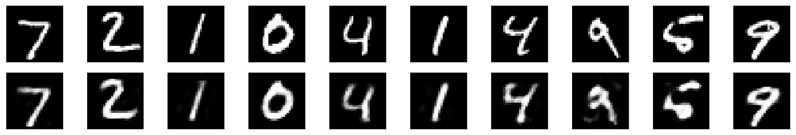
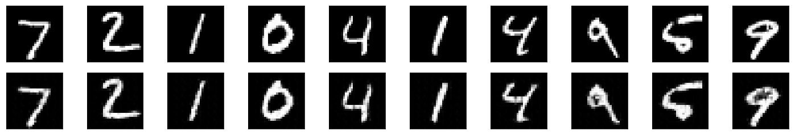
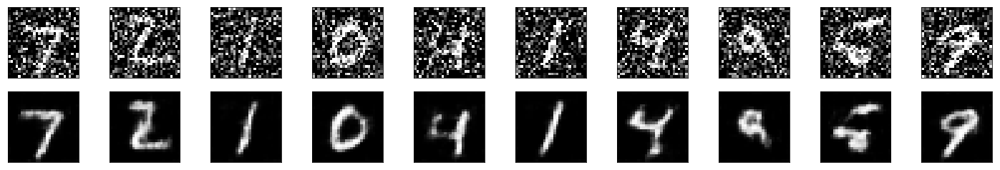

This is a pytorch implementation of 3 different autoencoders:  

### 1) linear autoencoder: 
    
This is a simple autoencoder based on fully connected feed-forward layers. We then train this autoencoder to compress images in the MNIST data. The input images are flattened into a vector before passing them to the autoencoder. The performance of the trained autoencoder was tested on a seperate set of testing images not used during training. 

Following is a sample of test images that were passed to the autoencoder and their reconstructions as produced by our autoencoder. In the following, the 1st row comprises of test images passed to the autoencoder while the second row are their corresponding reconstructions.  

For the most part the encoder output looks pretty good except that the images are slightly hazy.

### 2) convolutional autoencoder:

Since we are dealing with images, we naturally expect a CNN based autoencoder to do a better job. So, now we build a better autoencoder by using CNNs. Once again we train it on the MNIST dataset. 

Following is a sample of test images that were passed to the autoencoder and their reconstructions as produced by our autoencoder. In the following, the 1st row comprises of test images passed to the autoencoder while the second row are their corresponding reconstructions

As expected, we can clearly see that the images produces by the convolutional autoencoder are much more sharp and clear than those produced by the linear autoencoder. 

### 3) denoising autoencoder:

We now train and use a CNN based autoencoder for denoising images. Towards this end, we add some random noise to our training images and require the autoencoder to reconstruct their de-noised versions. 

Following is a sample of test images that were passed to the autoencoder and their reconstructions as produced by our autoencoder. In the following, the 1st row comprises of test images passed to the autoencoder while the second row are their corresponding reconstructions

We see that the autoencoder does a suprisingly great job of removing the noise, even though it is sometimes difficult to tell what the original number is.
